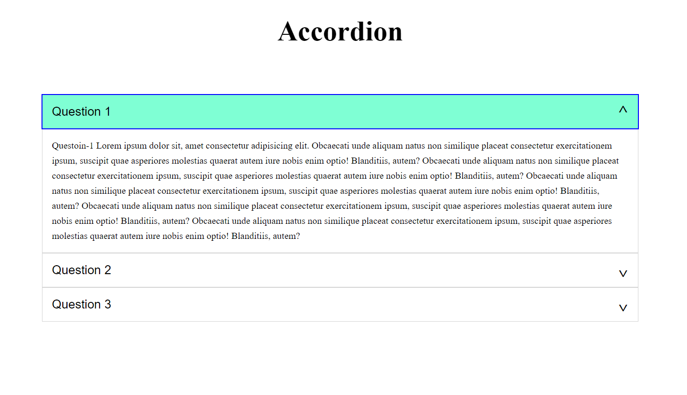

## Завдання 3.1

### Мета:

- Реалізувати акордеон для функціонала "питання-відповідь"

### Технології:

- html
- scss
- webpack
- icons library (e.g. font-awesome)
- fonts (google fonts)
- normalize.css

### Вимоги:

- Використовування jquery без додаткових бібліотек
- Акордеон з двома різними типами інтерфейсу
- Стилізувати акордеон на свій смак

### Опис:

Спочатку в обох випадках розгорнуть перше "питання-відповідь", інші згорнуті.
- перший тип інтерфейсу: можна розгорнути всі "питання-відповіді", натиснувши на кожен окремо
- другий тип інтерфейсу: при спробі розгорнути згорнуте "питання-відповідь", розгорнуте "питання-відповідь" згортається, тобто розгорнутим може бути тільки один

Також на сторінці повинен бути перемикач, який дозволить змінити тип інтерфейсу.

### Примітки:

Буде великим плюсом, якщо ви зможете реалізувати це завдання на чистому js, без використання jquery.

### Приклад інтерфейсу:

### !! Підвищення складності !!
###### _(для найздібніших)_

#### +Вимоги:
- На сторінці може бути необмежена кількість незалежних акордеонів (js отримує селектор акордеона для керування вкладеними панелями)
