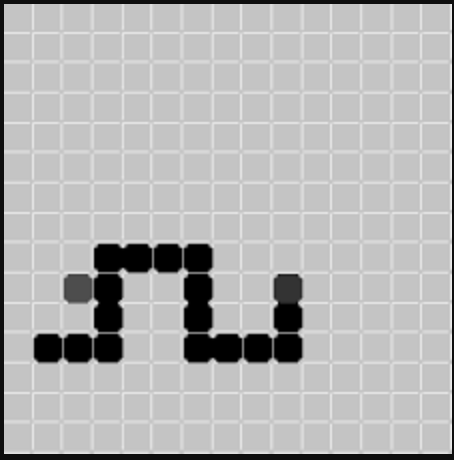

## Завдання 4.2

### Мета:
- Створити міні-гру

### Ідея:
- Створити міні-гру змійка

### Опис:
Гра завантажується, користувач бачить кнопку "Старт".  
Після натиснення на неї з'являється змейка, що складається з 3-х сегментів.  
- змійка збільшується у розмірах при зіткненні з яблуком
- змійка має "їсти" якомога більше яблук, щоб набрати максимальну кількість балів, при чому не врізатись у стіну та у саму себе.

### Вмирає:
- при зіткненню із собою
- при виході за межі екрану

С кожним балом швидкість змійки збільшується.  
Користувач бачить повідомлення про виграш після набору 50 балів.  

### Приклад інтерфейсу:

