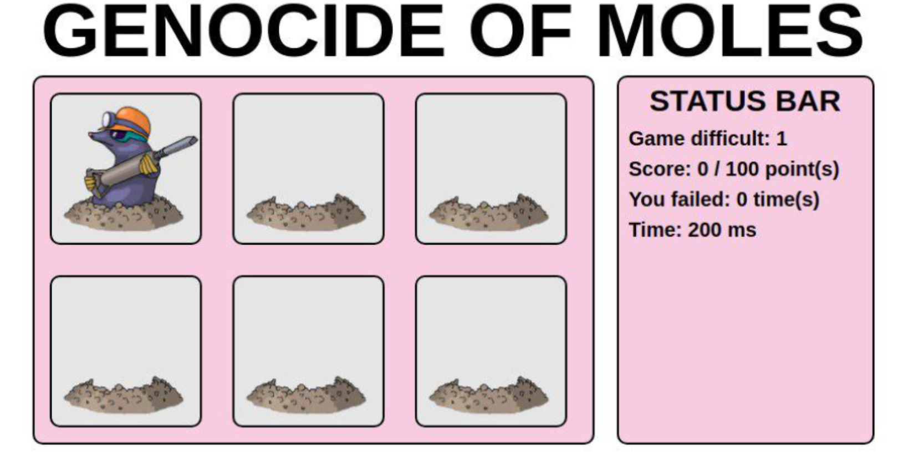

## Завдання 4.3

### Мета:

- Створити міні-гру

### Технології:

- html
- css/scss
- react

### Ідея:

- Створити міні-гру "Бий крота" (Whack-A-Mole)

### Опис:

Гра завантажується, користувач бачить кнопку "Старт".  
Після натискання неї з'являється основний інтерфейс: поле з норами, статистика.  
Після паузи у 20ms на полі у випадковій норі з'являється кріт на короткий проміжок часу (спочатку 4s).  
За відведений проміжок часу користувач повинен встигнути натиснути на нору з кротом.  
- у разі успіху нора підсвічується зеленим, гра призупиняється на 40ms, нора очищається від крота і через паузу 20ms генерується новий кріт;
  при цьому користувач отримує +1 балів.
- у випадку, якщо клік був попаданням поза ділянкою виграшної нори, нора підсвічується червоним, гра призупиняється на 40ms, очищається поле і через паузу у 20ms генерується новий кріт;
  при цьому користувач отримує +1 до провалів.
- якщо користувач не встиг натиснути за відведений час, після закінчення лічильника поле очищається і через паузу у 20ms генерується новий кріт; при цьому користувач отримує +1 до провалів.

Кожні 10 балів час на хід зменшується.  
У разі 3-х провалів гра закінчується поразкою, користувач бачить вікно поразки в якому відображається (кнопка "почати нову гру").  
У разі набору 100 балів гра закінчується, користувач бачить вікно перемоги, в якому відображається (число балів, кількість провалів, час на хід, складність гри (поточні бали/10), кнопка "почати нову гру").  

### Приклад інтерфейсу:

